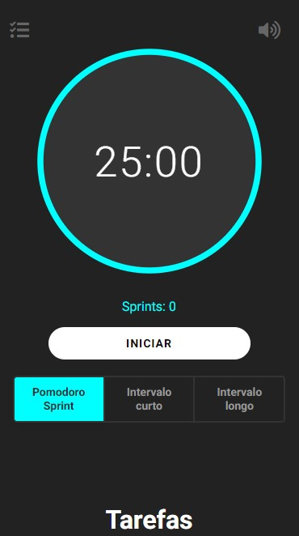

# Gerenciador de tempo de tarefas Pomodoro Sprint

Desenvolvido por FRONT DATA utilizando o framework REACT

Veja funcionando em https://frontdata.github.io/pomodoro-sprint/

# Funcionalidades

 - Aviso sonoro
 - Aviso por notificação
 - Mudanças automáticas entre sprint e intervalos
 - A cada 4 sprints muda para o intervalo longo

# Para testar localmente

 - npm install
 - npm start
 - Abrir no navegador o endereço: http://localhost:3000

# Próximas funcionalidades

* Integrar com API do Trello para exibir as tarefas dos quadros
* Criar avisos sonoros com textos falados 

Desenvolvido por Lucas do Rego: 
https://www.linkedin.com/in/lucasdorego/

Crédito e agradecimento à Luiz Batanero pelo código usado como referência e base inicial: 
https://github.com/luizbatanero